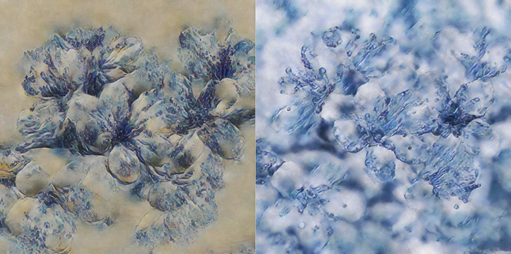
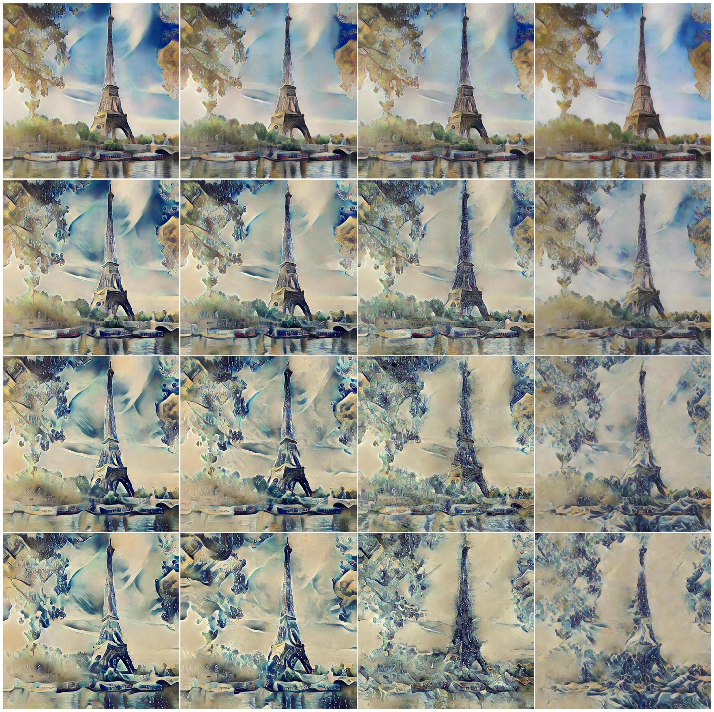
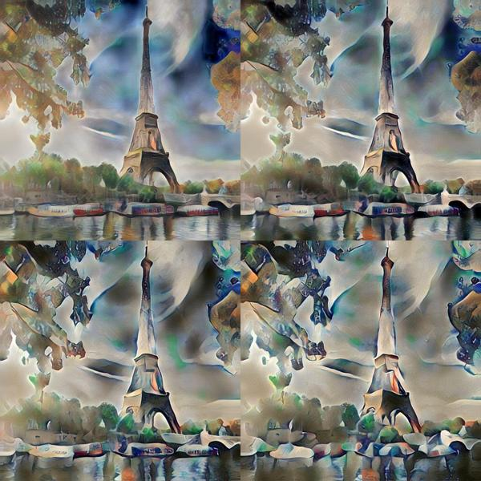

# Deep Style Transfer

Transfer the style of an image to a content image using VGG19 and different feature transform methods (Exact Optimal Transport, OT between Gaussian mixtures, between Gaussians, and Universal Style Transfer). [[demo!]](https://samuelbx.github.io/experiments/wst.html)



Adaptation of [pietrocarbo/deep-transfer](https://github.com/pietrocarbo/deep-transfer) for Master MVA's [image processing](https://judelo.github.io/pages/mva-introduction-a-limagerie-numerique/) course project.

References:
- Li, Y., Fang, C., Yang, J., Wang, Z., Lu, X., & Yang, M. H. (2017). Universal style transfer via feature transforms. *Advances in neural information processing systems, 30.*
- Mroueh, Y. (2019). Wasserstein style transfer. *arXiv preprint arXiv:1905.12828.*
- Delon, J., Desolneux, A. (2020). A Wasserstein-type distance in the space of Gaussian mixture models. *SIAM Journal on Imaging Sciences, 13(2), 936-970.*

## Installation

### Dependencies
- numpy, torch, torchvision, scikit-learn, pillow
- POT (Python Optimal Transport), but make sure to have a version that fixes issue [#689](https://github.com/PythonOT/POT/issues/689) or apply patch in `pot-patch/`.

## Usage

```bash
python main.py <content> <style> <method> [--out OUT] [--alpha ALPHA] [--K K]
```

### Positional Arguments:

- `content`: Path to the content image (must be in `.jpg` or `.png` format).
- `style`: Path to the style image (must be in `.jpg` or `.png` format).
- `method`: Feature transform type to use for style transfer. Available methods:
  - `exact`: Wasserstein Style Transfer
  - `wct`: Universal Style Transfer
  - `gaussian`: Gaussian-based feature transfer
  - `gmmot-bary`: GMM-OT barycentric map
  - `gmmot-rand`: GMM-OT random map

### Optional Arguments:

- `--out`: Directory where the stylized results will be saved (default: `./outputs/`).
- `--alpha`: Balance between the original content and stylized features (0 to 1, default: 0.2).
- `--K`: Number of Gaussian components for GMM-OT (default: 2).

### Example:

```bash
python main.py ./inputs/content/content1.jpg ./inputs/style/style2.jpg gmmot-bary --alpha 0.2 --K 5 --out ./results/
```

applies the GMM-OT transform to apply `style2.jpg` to `content1.jpg` with a balance factor of 0.2, using a Gaussian mixture with 5 components, and saves the result in the `./results/` directory.

## Results

(In columns) Gaussian, GMMOT(2), GMMOT(5) and Exact-OT :


Barycenters :

