| Content                                | Style                                  |
|----------------------------------------|----------------------------------------|
|  | 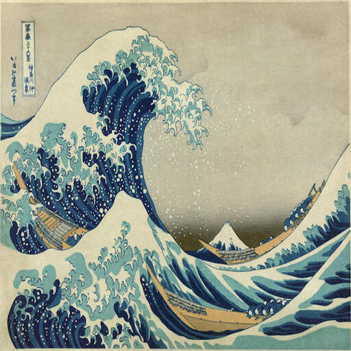 |

| Gaussian-OT                               | GMM(2)-OT                                | GMM(5)-OT                                |
|--------------------------------------------|------------------------------------------|------------------------------------------|
| 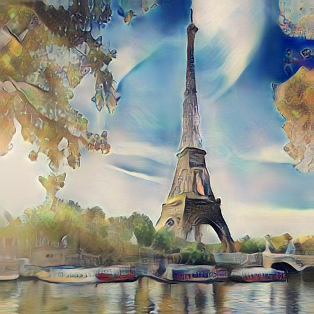 | 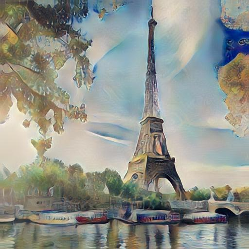 | 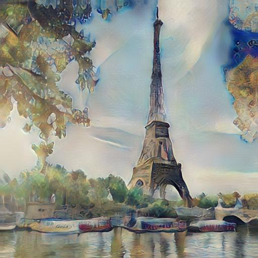 |
|  | 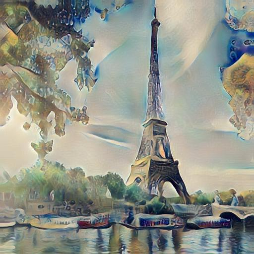 | 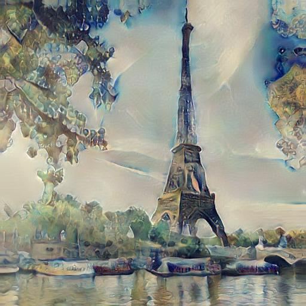 |
| 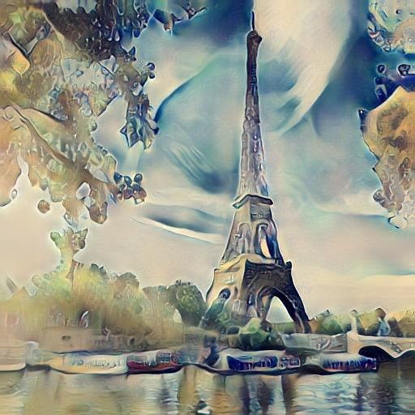 | 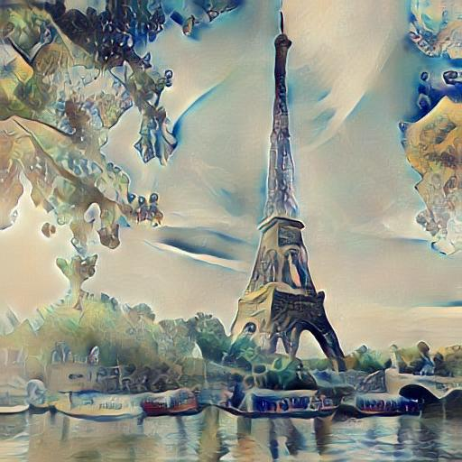 | 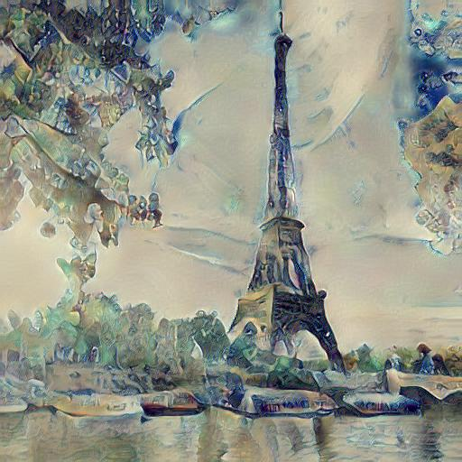 |
| 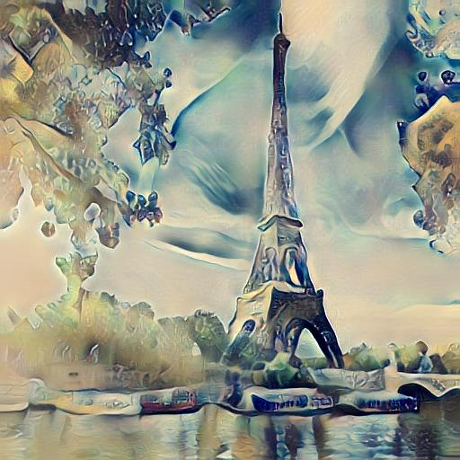 | 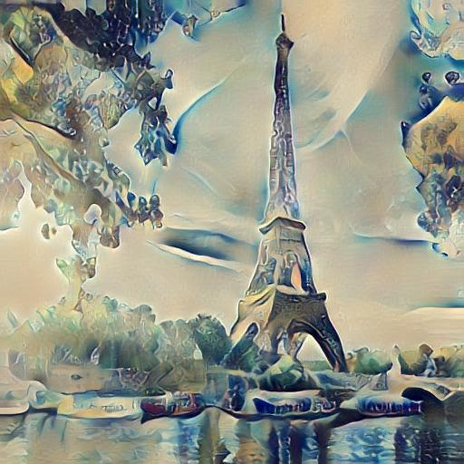 | 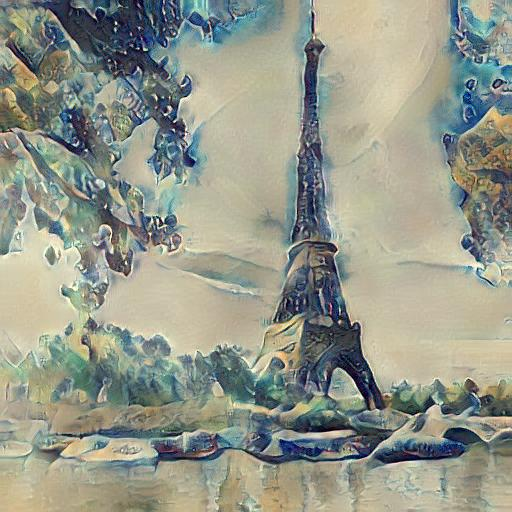 |
| 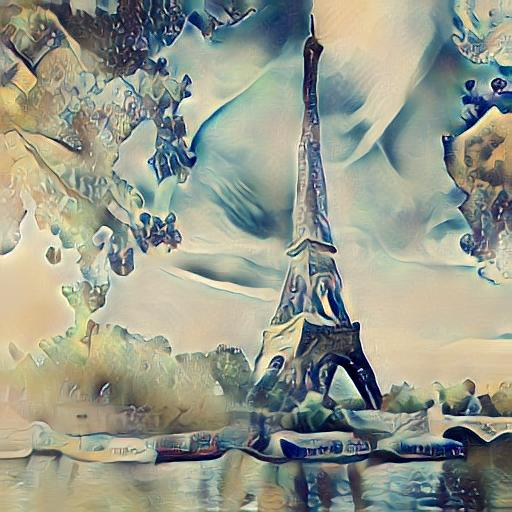 | 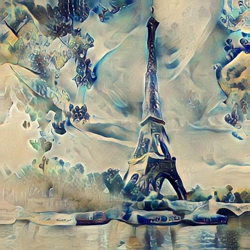 | 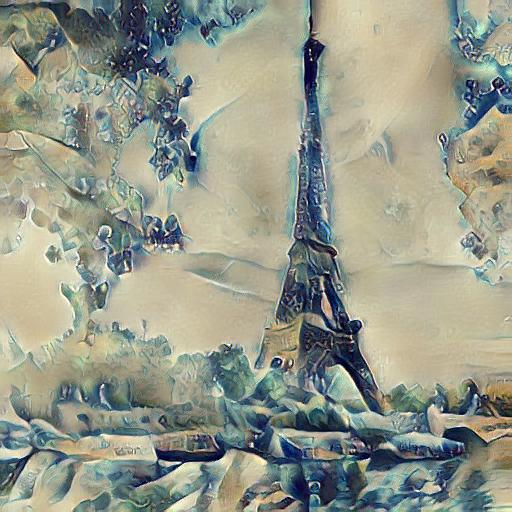 |
| 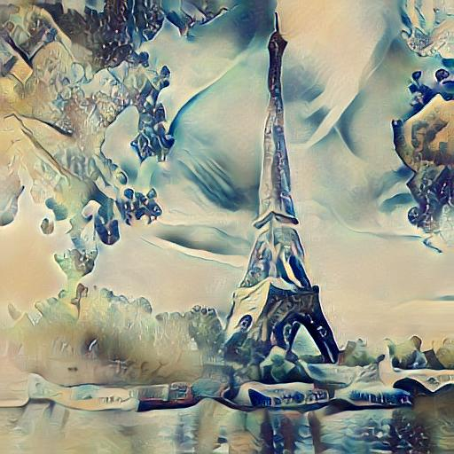 | 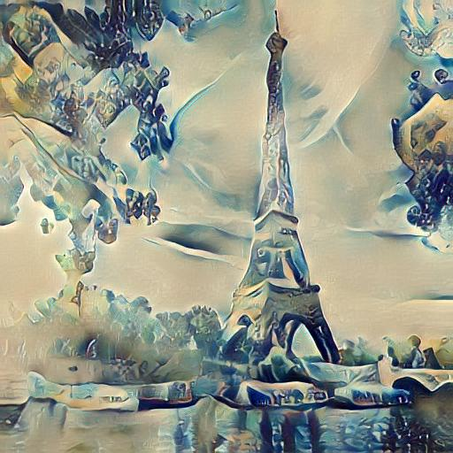 | 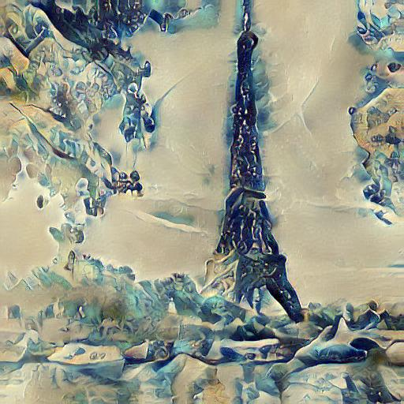 |
| 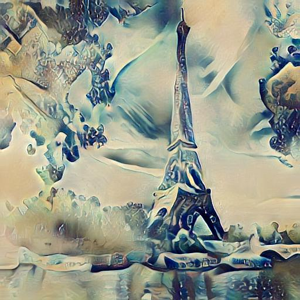 | 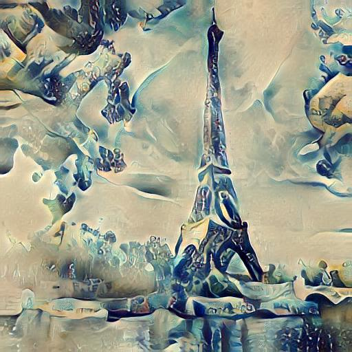 | 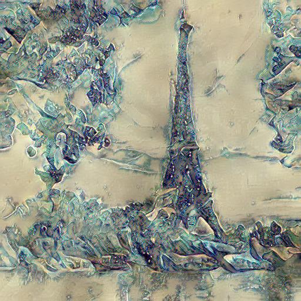 |
